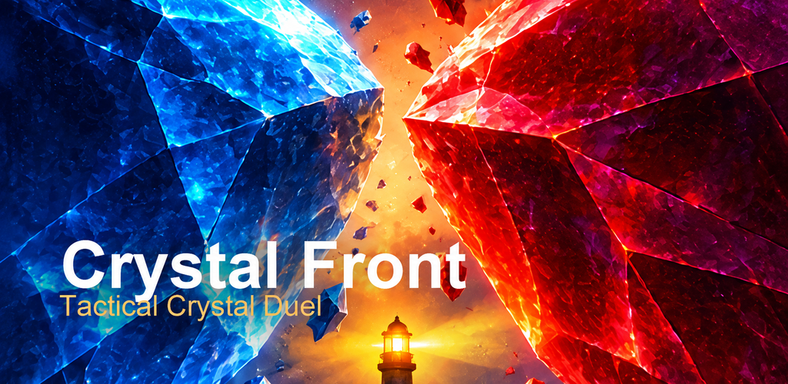
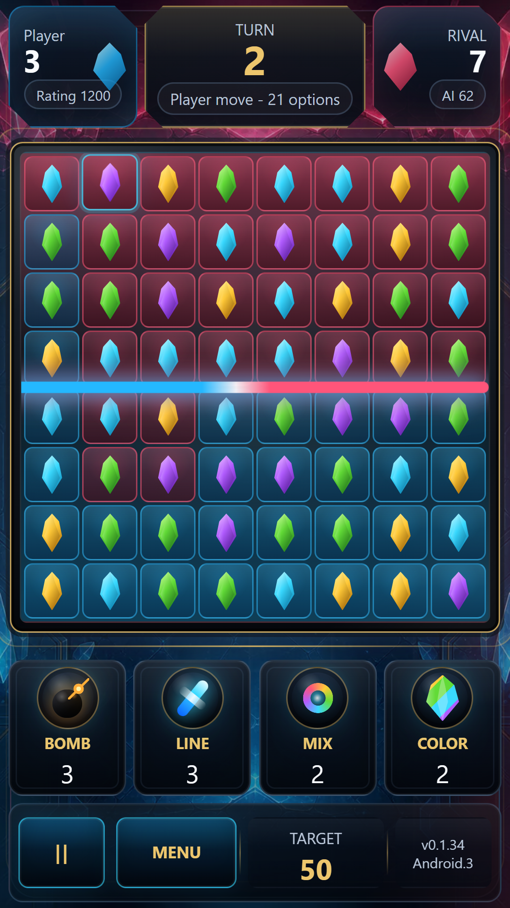
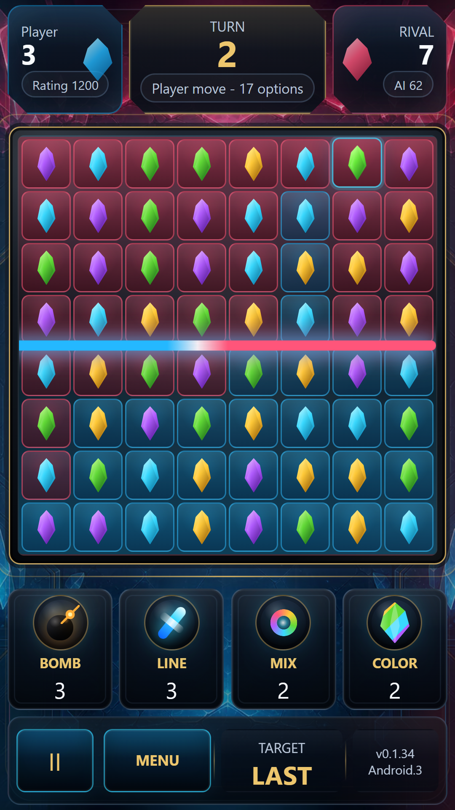
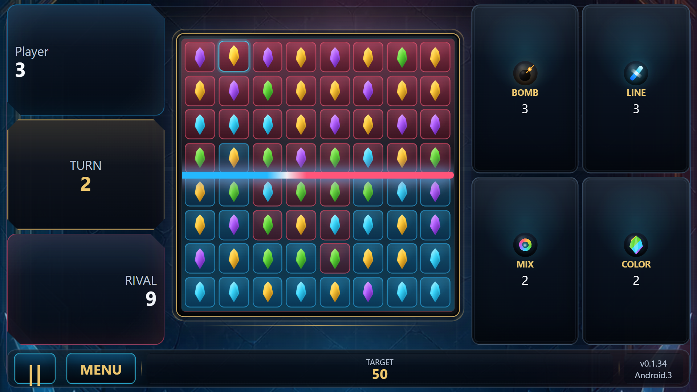

# Crystal Front — материалы Google Play для просмотра

Подготовлено 8 октября 2026. Это комплект для обсуждения, не опубликованная карточка Google Play.

- [Описание на русском](LISTING_RU.md)
- [English listing](LISTING_EN.md)
- [Тестовый APK 1.0.2-debug](../crystal-front-android-debug.apk)

## Квадратная иконка — кандидат

Этот вариант подготовлен из существующей иллюстрации. Композиция немного изменена; требуется утверждение владельца. В установленной игре иконка не заменена.

[Предыдущая иллюстрация](icon-512-reference.png) имеет заранее закруглённые углы и не является финальным исходником для Google Play.

## Обложка

## Игровые экраны

Скриншоты текущего bundled runtime сняты в Edge. Перед отправкой в магазин нужно сопоставить их с Android WebView. Это реальные игровые состояния без рекламных надписей. Два портретных и один альбомный кадр; рекомендованный третий портретный ещё не подготовлен.

Текущая версия работает офлайн, без рекламы, покупок за деньги и связи с LPA. Firebase Analytics включается по желанию игрока и по умолчанию выключена.
